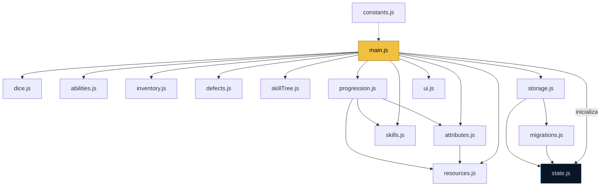

```
        ███████╗████████╗ █████╗ ██████╗     ██╗    ██╗ █████╗ ██████╗ ███████╗
        ██╔════╝╚══██╔══╝██╔══██╗██╔══██╗    ██║    ██║██╔══██╗██╔══██╗██╔════╝
        ███████╗   ██║   ███████║██████╔╝    ██║ █╗ ██║███████║██████╔╝███████╗
        ╚════██║   ██║   ██╔══██║██╔══██╗    ██║███╗██║██╔══██║██╔══██╗╚════██║
        ███████║   ██║   ██║  ██║██║  ██║    ╚███╔███╔╝██║  ██║██║  ██║███████║
        ╚══════╝   ╚═╝   ╚═╝  ╚═╝╚═╝  ╚═╝     ╚══╝╚══╝ ╚═╝  ╚═╝╚═╝  ╚═╝╚══════╝
                          R P G   ·   F I C H A   D E   P E R S O N A G E M
```

<div align="center">

### ⟪ DATAPAD DE PERSONAGEM · TERMINAL GALÁCTICO ⟪

*Uma ficha digital de RPG em estilo datapad imperial/rebelde — geométrica, modular e imersiva.*
*Roda 100% no navegador. Sem servidor. Sem framework. Sem dependências.*


</div>

---

> *"Esta é a ficha que você procura."*
>
> Um terminal de personagem que funciona offline, salva tudo no seu navegador e
> exporta sua jornada em um cristal de dados (`.json`) para nunca ser perdida na
> imensidão da galáxia.

---

## ⬡ ÍNDICE DE NAVEGAÇÃO

- [Briefing da Missão](#-briefing-da-missão)
- [As Quatro Abas](#-as-quatro-abas)
- [Recursos do Datapad](#-recursos-do-datapad)
- [Inicialização](#-inicialização)
- [Arquitetura da Nave](#-arquitetura-da-nave)
- [O Sistema de Jogo](#-o-sistema-de-jogo)
- [Manual de Operação](#-manual-de-operação)
- [Persistência de Dados](#-persistência-de-dados)
- [Stack Tecnológica](#-stack-tecnológica)
- [Transmissão Final](#-transmissão-final)

---

## ⟫ BRIEFING DA MISSÃO

A **Ficha RPG Star Wars** é uma interface de personagem completa para mesas de RPG
ambientadas em uma galáxia muito, muito distante. Em vez de papel, você opera um
**datapad**: campos de terminal, painéis chanfrados, badges técnicos, barras
segmentadas e um log de rolagens com cara de console de nave.

Tudo foi construído com **HTML, CSS e JavaScript puro (ES Modules)** — sem build,
sem `npm install`, sem internet. Basta abrir o arquivo e jogar.

```
┌─────────────────────────────────────────────────────────┐
│  STATUS ......... OPERACIONAL                             │
│  FRAMEWORK ...... NENHUM                                  │
│  DEPENDÊNCIAS ... ZERO                                    │
│  ARMAZENAMENTO .. LOCAL (navegador) + JSON exportável     │
│  CONEXÃO ........ OFFLINE-FIRST                           │
└─────────────────────────────────────────────────────────┘
```

---

## ⟫ AS QUATRO ABAS

O datapad é dividido em quatro terminais de operação:

| Aba | Ícone | Função |
|:----|:-----:|:-------|
| **Ficha** | ◈ | Identidade, atributos, recursos, perícias, habilidades, inventário, lore e histórico de rolagens. |
| **Defeitos** | ⚠ | Catálogo e gestão de defeitos (prontos + personalizados), com contador no badge. |
| **Árvore de Habilidades** | ⬡ | Árvore radial onde você cria manobras, técnicas da Força e habilidades únicas. |
| **Progressão** | ↑ | Economia de **Pontos de Evolução (PE)** para evoluir o personagem ao longo da campanha. |

---

## ⟫ RECURSOS DO DATAPAD

### ◈ Identidade
- Nome, jogador, espécie, arquétipo, conceito, facção/aliança e planeta de origem.
- **Retrato por URL** em moldura técnica com cantos de mira.

### ♥ Painel de Sessão
- **PV** (Pontos de Vida) com barra colorida dinâmica e botões de dano/cura/restaurar.
- **Esforço** (Manobras) e **Conexão** (Técnicas da Força) com medidores próprios.
- **Movimento** em metros, derivado automaticamente do Corpo.
- **Última rolagem** espelhada em destaque, com cor de sucesso/falha.
- Condição atual e créditos.

### ⬡ Atributos e Rolagens
- Cinco atributos: **Vida, Corpo, Mente, Presença, Espírito**.
- Validação automática da distribuição obrigatória **50 / 40 / 30 / 20 / 10**.
- Cálculo de pontos gerados por atributo e controle de gasto/restante.
- Rolagem **1d100** por atributo com feedback visual de sucesso/falha.

### ◆ Perícias
- Criação livre de perícias com atributo, **grau (S/A/B/C/D/E)**, custo e descrição.
- **Filtro por atributo** e rolagem direta aplicando a lógica de cada grau.

### ✦ Habilidades Únicas
- Talentos, técnicas e dons da Força com frequência, custo adicional e estado
  **usada / não usada** (marcar, resetar, remover).

### ⬙ Inventário e Equipamentos
- Slots fixos: arma principal/secundária, armadura, nave, droide e item especial.
- Inventário dinâmico com tipo, quantidade e descrição.
- **Propriedades de armas** a partir de um catálogo canônico com 6 categorias
  (Gerais, Alcance e Mira, Dano, Energéticas e Tecnológicas, Táticas, Especiais).

### ⬡ Árvore de Habilidades
- Árvore **radial** com 5 hubs de categoria (Combate, Técnica, Força, Social, Sobrevivência).
- Criação livre de nós — **manobras, técnicas da Força, habilidades únicas, passivas e reações**.
- Posicionamento automático dos nós, filtro por categoria e compra com pontos.

### ↑ Progressão
- Economia de **Pontos de Evolução (PE)** para evoluir o personagem na campanha.
- Aumenta atributos e recursos, cria/melhora perícias e cria manobras/técnicas.
- Tudo reflete automaticamente na Ficha (atributos, recursos e perícias).

### ⚠ Defeitos
- Aba dedicada com **resumo de regras**, total de pontos, contagem e maior gravidade.
- Catálogo de defeitos prontos (1 a 5 pontos) com filtro + criador personalizado.
- Destaque visual crescente por gravidade (defeitos **4 e 5** ganham alerta marcante).

### ◎ Lore e Notas
- História, personalidade, aparência, motivações, medos, relações, dívidas,
  segredos e objetivo atual — em **acordeão recolhível** para economizar espaço.
- **Notas do Mestre** em seção colapsável separada.

---

## ⟫ INICIALIZAÇÃO

Nenhuma instalação. Nenhum hipermotor necessário.

```bash
# 1. Clone ou baixe este repositório
git clone <url-do-repositorio>

# 2. Entre na pasta
cd "Ficha RPG Stars Wars"

# 3. Abra a ficha no navegador
#    Basta dar duplo-clique em index.html
```

> 💡 **Dica de hologramador:** como o projeto usa ES Modules (`type="module"`),
> alguns navegadores bloqueiam `import` via `file://`. Se os módulos não
> carregarem, sirva a pasta localmente:
>
> ```bash
> # Python 3
> python -m http.server 8000
> # depois acesse: http://localhost:8000
> ```
>
> Ou use a extensão **Live Server** do VS Code.

---

## ⟫ ARQUITETURA DA NAVE

Código **modular** por responsabilidade — cada sistema é uma peça independente.

```
Ficha RPG Stars Wars/
│
├── index.html              # Estrutura da ficha (4 abas)
│
├── css/
│   ├── base.css            # Variáveis, reset, tipografia e tema datapad
│   ├── layout.css          # Header, grid principal e estrutura de seções
│   ├── components.css      # Cards, inputs, botões, badges e cards de listas
│   ├── tabs.css            # Navegação entre abas e troca de painéis
│   ├── skilltree.css       # Árvore de habilidades radial (nós e hubs)
│   ├── progression.css     # Aba de progressão (PE)
│   └── responsive.css      # Media queries (carregado por último)
│
└── js/
    ├── main.js             # Ponto de entrada: listeners e inicialização
    ├── constants.js        # Fonte única de chaves, versões e valores fixos
    ├── state.js            # Estado central da ficha
    ├── dom.js              # Utilitários de DOM (byId, getVal, escapeHtml...)
    ├── validators.js       # Validação e sanitização puras (sem DOM)
    ├── attributes.js       # Atributos, pontos e validação de distribuição
    ├── dice.js             # Sistema de rolagem 1d100 e histórico
    ├── skills.js           # Perícias personalizadas + filtro
    ├── abilities.js        # Habilidades únicas
    ├── inventory.js        # Inventário e equipamentos
    ├── weaponProperties.js # Catálogo canônico de propriedades de armas
    ├── resources.js        # Esforço, Conexão e Movimento
    ├── defects.js          # Defeitos (prontos + personalizados)
    ├── skillTree.js        # Árvore de habilidades radial
    ├── progression.js      # Pontos de Evolução (PE) e economia de progressão
    ├── migrations.js       # Migração de saves antigos para a versão atual
    ├── storage.js          # LocalStorage + exportar/importar JSON
    └── ui.js               # Abas, acordeões, retrato, PV e feedback
```



---

## ⟫ O SISTEMA DE JOGO

### ◇ Atributos
Distribuição obrigatória dos cinco valores entre os atributos:

| Valor | Aplicação |
|:-----:|:----------|
| **50** | atributo dominante |
| **40** | atributo forte |
| **30** | atributo médio |
| **20** | atributo fraco |
| **10** | atributo limitado |

**Pontos gerados por atributo:**
```js
pontos = Math.floor(atributo / 10) * 2
```

### ◇ Rolagem de Atributo
Rola **1d100**. É **sucesso** se o resultado for **menor ou igual** ao atributo.

### ◇ Graus de Perícia
No d100, **menor é melhor**.

| Grau | Regra |
|:----:|:------|
| **S** | Sucesso automático em situações comuns |
| **A** | Rola **3d100**, fica com o **menor** |
| **B** | Rola **2d100**, fica com o **menor** |
| **C** | Rola **2d100**, fica com o **menor** |
| **D** | Rola **1d100** |
| **E** | Rola **2d100**, fica com o **maior** |

### ◇ Recursos Derivados

| Recurso | Fórmula | Origem |
|:--------|:--------|:------:|
| **Esforço** | `Math.floor(corpo / 10) + 3` | Corpo |
| **Conexão** | `Math.floor(espirito / 10) + 2` | Espírito |
| **Movimento** | `Math.floor(corpo / 10) + 6` | Corpo |

> Os recursos se recalculam sozinhos sempre que os atributos mudam.
> Bônus vindos da **Progressão** são somados aos valores finais.

### ◇ Pontos de Evolução (PE)

A aba **Progressão** controla a evolução do personagem na campanha. Você ganha e
gasta **PE** para melhorar a ficha:

| Compra | Custo |
|:-------|:------|
| **Atributo** | 4 PE → +5 no valor final |
| **Recurso** (Esforço/Conexão) | 2 PE → +1 no máximo |
| **Perícia** (criar, grau D) | 2 PE |
| **Evoluir perícia** (D→C→B→A→S) | C=2, B=3, A=4, S=5 PE |
| **Manobra** | Simples 4 · Avançada 8 · Rara 12 PE |
| **Técnica da Força** | Simples 6 · Avançada 12 · Rara 18 PE |
| **Habilidade Única** | Simples 10 · Forte 15 · Muito Forte 20 PE |

> Cada compra reflete automaticamente na Ficha e nos recursos derivados.

---

## ⟫ MANUAL DE OPERAÇÃO

```
[1] Preencha a IDENTIDADE e cole a URL do retrato.
[2] Distribua os ATRIBUTOS (50/40/30/20/10) — o painel valida em tempo real.
[3] Ajuste PV, Esforço e Conexão no PAINEL DE SESSÃO.
[4] Crie PERÍCIAS e HABILIDADES gastando os pontos gerados.
[5] Monte o INVENTÁRIO e os equipamentos.
[6] Use os BOTÕES DE ROLAR — o resultado aparece em destaque e no histórico.
[7] Configure DEFEITOS na aba dedicada.
[8] Monte a ÁRVORE DE HABILIDADES com manobras e técnicas.
[9] Evolua o personagem na aba PROGRESSÃO gastando PE.
[10] SALVE a ficha ou EXPORTE para JSON.
```

---

## ⟫ PERSISTÊNCIA DE DADOS

A ficha protege sua jornada em duas camadas:

- 💾 **LocalStorage** — salvamento automático no navegador (`Salvar` / `Carregar`).
- 📦 **JSON exportável** — baixe um arquivo `.json` (cristal de dados) para backup,
  partilha ou transferência entre dispositivos (`Exportar` / `Importar`).
- � **Migração automática** — saves antigos são atualizados para a versão atual ao carregar.
- �🗑 **Apagar** — remove a ficha salva (com confirmação) sem alterar a tela.

> Seus dados nunca saem do seu equipamento. **Nada é enviado para servidores.**

---

## ⟫ STACK TECNOLÓGICA

| Camada | Tecnologia |
|:-------|:-----------|
| Estrutura | **HTML5** semântico, acessível (`role`, `aria-*`) |
| Estilo | **CSS3** — variáveis, `clip-path` (chanfros), grid, scanlines |
| Lógica | **JavaScript (ES Modules)**, sem `onclick` inline |
| Persistência | **LocalStorage** + **Blob/FileReader** (JSON) |
| Build | **Nenhum** — abra e use |

**Princípios do projeto:**
- ✅ Zero dependências e zero build.
- ✅ Mobile-first responsivo, sem rolagem horizontal.
- ✅ `addEventListener` em vez de handlers inline.
- ✅ Separação clara de responsabilidades por módulo.

---

## ⟫ TRANSMISSÃO FINAL

<div align="center">

Projeto **fan-made**, sem fins lucrativos e **sem logos ou marcas oficiais**.
*Star Wars* é uma marca registrada da Lucasfilm Ltd. / The Walt Disney Company.
Este é um projeto de fã, não afiliado nem endossado pelos detentores dos direitos.

Distribuído sob a licença **MIT**.

---

**Que a Força esteja com seus dados.** ✦

```
> FIM DA TRANSMISSÃO
> CANAL SEGURO ENCERRADO
```

</div>
